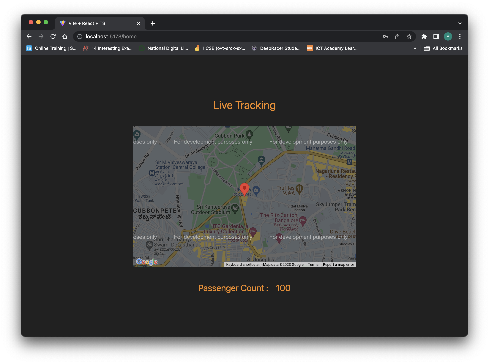

# Vehicle Tracking System

## Arduino to MQTT Data Transmission

### Overview
The Arduino code is designed to gather location data using a GPS module and transmit it along with passenger count information to an MQTT broker.

```cpp
// Arduino Code for MQTT Data Transmission
// (Includes TinyGPS++, ArduinoJson, ArduinoMqttClient libraries)
#include <ArduinoJson.h>
#include <TinyGPS++.h>
#include <ArduinoMqttClient.h>
#include <ESP8266WiFi.h>

#define IRPIN_IN 9
#define IRPIN_OUT 10

DynamicJsonDocument doc(200);
TinyGPSPlus gps;
WiFiClient wifiClient;
MqttClient mqttClient(wifiClient);

const char broker[] = "192.168.29.170";
int port = 1883;
const char topic[] = "pto_data";
int totalPas = 0;
unsigned long previousMillis = 0;
const long interval = 10000;  // 10 seconds interval

void addLocationData(JsonDocument &doc, float latitude, float longitude) {
  JsonObject location = doc.createNestedObject("location");
  location["lat"] = latitude;
  location["lng"] = longitude;
}

void addRidershipData(JsonDocument &doc, int totalPassengers) {
  JsonObject ridership = doc.createNestedObject("ridership");
  ridership["total"] = totalPassengers;
}

void connectWiFi() {
  Serial.print("Connecting to WiFi");
  WiFi.begin("Rahul's Galaxy S20+", "Rahul@123");
  while (WiFi.status() != WL_CONNECTED) {
    delay(500);
    Serial.print(".");
  }
  Serial.println("\nConnected to WiFi!");
}

bool connectToMQTT() {
  int attempt = 0;
  while (!mqttClient.connect(broker, port)) {
    Serial.print("MQTT connection failed! Error code = ");
    Serial.println(mqttClient.connectError());
    if (attempt > 5) {
      Serial.println("Exceeded maximum attempts. Please check MQTT broker.");
      return false;
    }
    delay(2000);
    attempt++;
  }
  Serial.println("Connected to MQTT broker!");
  return true;
}

void setup() {
  Serial.begin(115200);
  pinMode(IRPIN_IN, INPUT);
  pinMode(IRPIN_OUT, INPUT);
  connectWiFi();
  
  if (!connectToMQTT()) {
    while (1) {
      // Stay in a loop if MQTT connection fails for safety measures
      delay(1000);
    }
  }
}

void loop() {
  mqttClient.poll();
  unsigned long currentMillis = millis();

  while (Serial.available() > 0) {
    if (gps.encode(Serial.read())) {
      break;
    }
  }

  if (!mqttClient.connected()) {
    if (!connectToMQTT()) {
      // Handle reconnection attempts or safety measures here
      // For now, we will just try to reconnect
      return;
    }
  }

  if (currentMillis - previousMillis >= interval) {
    previousMillis = currentMillis;
    mqttClient.beginMessage(topic);

    addLocationData(doc, gps.location.lat(), gps.location.lng());

    if (digitalRead(IRPIN_IN) == HIGH) {
      totalPas++;
    }
    if (digitalRead(IRPIN_OUT) == HIGH) {
      totalPas--;
    }

    addRidershipData(doc, totalPas);

    serializeJson(doc, mqttClient);
    mqttClient.endMessage();
    doc.clear();
  }
}
```

## Fetching MQTT Data into Server

### Overview
This Python code snippet utilizes the Paho MQTT client to receive data from the MQTT broker. The received JSON payload is decoded and stored for use in a server application.

```python
# Python Code for Fetching MQTT Data into Server
# (Utilizes Paho MQTT Client and Flask framework)
import json
import paho.mqtt.client as mqtt
from flask import Flask, render_template, jsonify
from flask_cors import CORS

app = Flask("PTO_Backend")
CORS(app)

data = {}  # Initialize data variable

def on_message(client, userdata, message):
    global data
    data = json.loads(message.payload.decode("utf-8"))
    print("Received message:", data)

mqtt_client = mqtt.Client(protocol=mqtt.MQTTv5)
mqtt_client.on_message = on_message

try:
    mqtt_client.connect("192.168.29.170", 1883)
    topic = "pto_data"
    mqtt_client.subscribe(topic)
    print("Subscribed to topic:", topic)
    mqtt_client.loop_start()  # Start the MQTT client loop

except Exception as e:
    print(f"Error: {str(e)}")
    mqtt_client.disconnect()

@app.route('/')
def index():
    return render_template('index.html')

@app.route('/data', methods=['GET'])
def get_data():
    return jsonify(data)

if __name__ == "__main__":
    app.run(port=5500, threaded=True)
```

## Frontend for Vehicle Tracking

### Overview
This React code snippet demonstrates a frontend application designed to visualize the real-time location of the vehicle on a Google Map, along with the current passenger count.

```javascript
// Frontend React Code for Vehicle Tracking
// (Utilizes @react-google-maps/api and Axios for data retrieval)
import { useJsApiLoader, GoogleMap, Marker } from "@react-google-maps/api";
import { useEffect, useState } from "react";
import axios from "axios";

const Home = () => {
  const [currentLocation, setCurrentLocation] = useState({
    lat: 0,
    lng: 0,
  });
  const [passengerCount, setPassengerCount] = useState(0);

  useEffect(() => {
    const fetch = async () => {
      await axios.get(import.meta.env.VITE_API_URL! + "/data").then((res) => {
        console.log(res.data);
        setCurrentLocation({
          lat: parseFloat(res.data.location.lat),
          lng: parseFloat(res.data.location.lng),
        });
        setPassengerCount(res.data.ridership.total);
      });
    };
    setTimeout(() => {
      fetch();
    }, 5000);
  }, [currentLocation]);

  const { isLoaded } = useJsApiLoader({
    id: "google-map-script",
    googleMapsApiKey: import.meta.env.VITE_MAPS_API_KEY!,
  });

  return (
    <div className="flex flex-col gap-10">
      <h2 className="text-3xl text-primary text-center">Live Tracking</h2>
      {isLoaded ? (
        <GoogleMap
          center={currentLocation}
          zoom={15}
          mapContainerStyle={{ width: "50vw", height: "50vh" }}
          options={{
            zoomControl: false,
            streetViewControl: false,
            mapTypeControl: false,
            fullscreenControl: false,
          }}
        >
          <Marker position={currentLocation} />
        </GoogleMap>
      ) : null}

      <div className="flex flex-row gap-5 items-center justify-center">
        <h2 className="text-2xl text-primary">Passenger Count : </h2>
        <h2 className="text-2xl text-primary">{passengerCount}</h2>
      </div>
    </div>
  );
};

export default Home;
```
#### App Snapshot


Each segment serves a specific purpose:
- **Arduino Code**: Transmits location and passenger count data via MQTT.
- **Python Server Code**: Receives MQTT data and stores it for a server-side application.
- **Frontend React Code**: Visualizes live vehicle location and passenger count.

This system allows for real-time tracking and monitoring of a vehicle's location and occupancy.