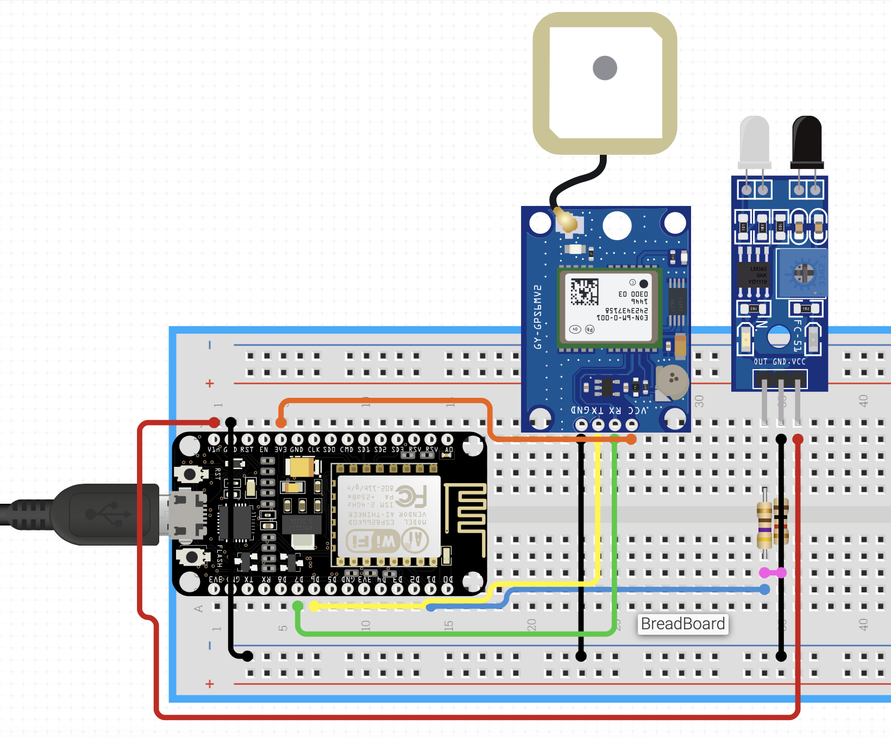
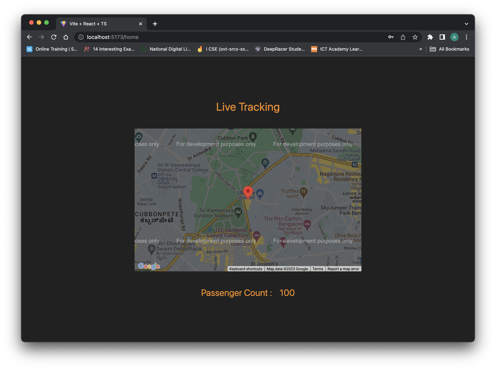

# Public Transportation Optimization Project Documentation

## Overview

The Public Transportation Optimization project aims to revolutionize public transportation services by implementing IoT sensors, real-time data processing, and a comprehensive transit information platform. The primary goal is to provide accurate and real-time information to passengers, including vehicle locations, estimated arrival times, and ridership statistics. This documentation covers the project's objectives, IoT sensor deployment, platform development, code implementation, and explains the enhancements brought to public transportation services and passenger experiences.

## Objectives

The project objectives are outlined to:

1. **Real-time Transit Information:** Deliver precise and up-to-date transit details to passengers.
2. **Arrival Time Prediction:** Develop algorithms to forecast arrival times based on real-time data.
3. **Ridership Monitoring:** Track passenger count for efficient service allocation and safety.
4. **Enhanced Service Quality:** Elevate customer satisfaction and convenience.

## IoT Sensor Deployment

### Components Deployed

- **GPS Sensors:** Installed to accurately track the real-time location of vehicles.
- **Passenger Counting (IR Sensors):** Utilized at entrances and exits to monitor passenger counts.

### Schematics



### Implementation (Arduino - C++)

```C++
// Arduino Code for MQTT Data Transmission
// (Includes TinyGPS++, ArduinoJson, ArduinoMqttClient libraries)
#include <ArduinoJson.h>
#include <TinyGPS++.h>
#include <ArduinoMqttClient.h>
#include <ESP8266WiFi.h>

#define IRPIN_IN 9
#define IRPIN_OUT 10

DynamicJsonDocument doc(200);
TinyGPSPlus gps;
WiFiClient wifiClient;
MqttClient mqttClient(wifiClient);

const char broker[] = "192.168.29.170";
int port = 1883;
const char topic[] = "pto_data";
int totalPas = 0;
unsigned long previousMillis = 0;
const long interval = 10000;  // 10 seconds interval

void addLocationData(JsonDocument &doc, float latitude, float longitude) {
  JsonObject location = doc.createNestedObject("location");
  location["lat"] = latitude;
  location["lng"] = longitude;
}

void addRidershipData(JsonDocument &doc, int totalPassengers) {
  JsonObject ridership = doc.createNestedObject("ridership");
  ridership["total"] = totalPassengers;
}

void connectWiFi() {
  Serial.print("Connecting to WiFi");
  WiFi.begin("Rahul's Galaxy S20+", "Rahul@123");
  while (WiFi.status() != WL_CONNECTED) {
    delay(500);
    Serial.print(".");
  }
  Serial.println("\nConnected to WiFi!");
}

bool connectToMQTT() {
  int attempt = 0;
  while (!mqttClient.connect(broker, port)) {
    Serial.print("MQTT connection failed! Error code = ");
    Serial.println(mqttClient.connectError());
    if (attempt > 5) {
      Serial.println("Exceeded maximum attempts. Please check MQTT broker.");
      return false;
    }
    delay(2000);
    attempt++;
  }
  Serial.println("Connected to MQTT broker!");
  return true;
}

void setup() {
  Serial.begin(115200);
  pinMode(IRPIN_IN, INPUT);
  pinMode(IRPIN_OUT, INPUT);
  connectWiFi();
  
  if (!connectToMQTT()) {
    while (1) {
      // Stay in a loop if MQTT connection fails for safety measures
      delay(1000);
    }
  }
}

void loop() {
  mqttClient.poll();
  unsigned long currentMillis = millis();

  while (Serial.available() > 0) {
    if (gps.encode(Serial.read())) {
      break;
    }
  }

  if (!mqttClient.connected()) {
    if (!connectToMQTT()) {
      // Handle reconnection attempts or safety measures here
      // For now, we will just try to reconnect
      return;
    }
  }

  if (currentMillis - previousMillis >= interval) {
    previousMillis = currentMillis;
    mqttClient.beginMessage(topic);

    addLocationData(doc, gps.location.lat(), gps.location.lng());

    if (digitalRead(IRPIN_IN) == HIGH) {
      totalPas++;
    }
    if (digitalRead(IRPIN_OUT) == HIGH) {
      totalPas--;
    }

    addRidershipData(doc, totalPas);

    serializeJson(doc, mqttClient);
    mqttClient.endMessage();
    doc.clear();
  }
}
```

## Platform Development

### Tech Stack Utilized

- **Front-End:** Developed using HTML, CSS, JavaScript, and React for dynamic updates.
- **Back-End:** Implemented in Python using Flask frameworks.
- **Real-time Communication:** Employed MQTT for seamless sensor-to-platform communication.

### Screenshots
  
**Real-time Data Display and Transit Information:**
   

### Implementation (Python)

```Python
# Python Code for Fetching MQTT Data into Server
# (Utilizes Paho MQTT Client and Flask framework)
import json
import paho.mqtt.client as mqtt
from flask import Flask, render_template, jsonify
from flask_cors import CORS

app = Flask("PTO_Backend")
CORS(app)

data = {}  # Initialize data variable

def on_message(client, userdata, message):
    global data
    data = json.loads(message.payload.decode("utf-8"))
    print("Received message:", data)

mqtt_client = mqtt.Client(protocol=mqtt.MQTTv5)
mqtt_client.on_message = on_message

try:
    mqtt_client.connect("192.168.29.170", 1883)
    topic = "pto_data"
    mqtt_client.subscribe(topic)
    print("Subscribed to topic:", topic)
    mqtt_client.loop_start()  # Start the MQTT client loop

except Exception as e:
    print(f"Error: {str(e)}")
    mqtt_client.disconnect()

@app.route('/')
def index():
    return render_template('index.html')

@app.route('/data', methods=['GET'])
def get_data():
    return jsonify(data)

if __name__ == "__main__":
    app.run(port=5500, threaded=True)
```

### Frontend (React)

The React code for live vehicle tracking is provided below:

```JavaScript
// Frontend React Code for Vehicle Tracking
// (Utilizes @react-google-maps/api and Axios for data retrieval)
import { useJsApiLoader, GoogleMap, Marker } from "@react-google-maps/api";
import { useEffect, useState } from "react";
import axios from "axios";

const Home = () => {
  const [currentLocation, setCurrentLocation] = useState({
    lat: 0,
    lng: 0,
  });
  const [passengerCount, setPassengerCount] = useState(0);

  useEffect(() => {
    const fetch = async () => {
      await axios.get(import.meta.env.VITE_API_URL! + "/data").then((res) => {
        console.log(res.data);
        setCurrentLocation({
          lat: parseFloat(res.data.location.lat),
          lng: parseFloat(res.data.location.lng),
        });
        setPassengerCount(res.data.ridership.total);
      });
    };
    setTimeout(() => {
      fetch();
    }, 5000);
  }, [currentLocation]);

  const { isLoaded } = useJsApiLoader({
    id: "google-map-script",
    googleMapsApiKey: import.meta.env.VITE_MAPS_API_KEY!,
  });

  return (
    <div className="flex flex-col gap-10">
      <h2 className="text-3xl text-primary text-center">Live Tracking</h2>
      {isLoaded ? (
        <GoogleMap
          center={currentLocation}
          zoom={15}
          mapContainerStyle={{ width: "50vw", height: "50vh" }}
          options={{
            zoomControl: false,
            streetViewControl: false,
            mapTypeControl: false,
            fullscreenControl: false,
          }}
        >
          <Marker position={currentLocation} />
        </GoogleMap>
      ) : null}

      <div className="flex flex-row gap-5 items-center justify-center">
        <h2 className="text-2xl text-primary">Passenger Count : </h2>
        <h2 className="text-2xl text-primary">{passengerCount}</h2>
      </div>
    </div>
  );
};

export default Home;
```

## Improvements in Public Transportation

The real-time transit information system presents significant enhancements to public transportation services and the passenger experience by:

- Providing accurate arrival times, reducing waiting periods.
- Assisting passengers in efficient route planning.
- Enhancing safety measures by monitoring ridership.
- Elevating overall customer satisfaction, encouraging increased ridership.

## Conclusion

The integration of IoT sensors, a robust transit information platform, and real-time data display promises a new era of efficient and convenient public transportation services. This comprehensive system is expected to benefit both service providers and passengers, ensuring a seamless and improved commuting experience.